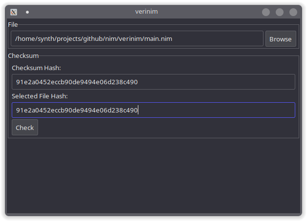
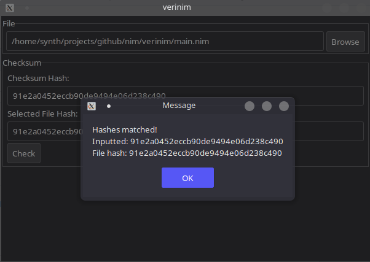

# verinim
A tool made in Nim that allows you to verify the checksum of a file

 
# usage
```
git clone https://github.com/Synth9283/verinim.git
cd verinim
```
If Nim is installed:
```
nim c -o:executable-name --app:gui -d:release main.nim
./executable-name
```
For users without Nim installed:
    Download the executable compatible for you in the releases directory
